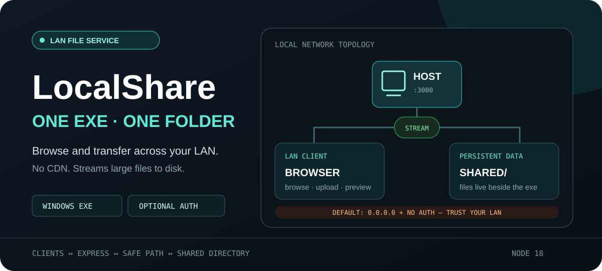
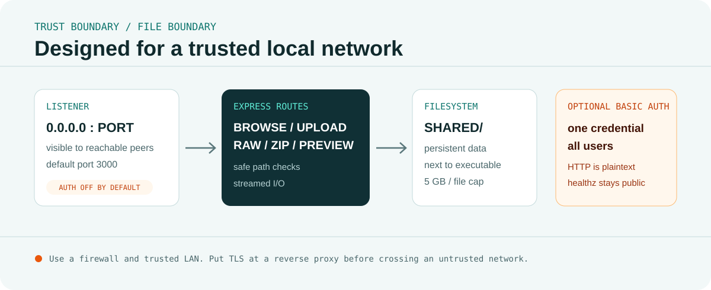

<p align="center">
  
</p>

<p align="center">
  <a href="#快速开始"><strong>快速开始</strong></a> ·
  <a href="#打包-windows-exe">Windows EXE</a> ·
  <a href="#安全边界">安全边界</a> ·
  <a href="#http-api">HTTP API</a>
</p>

## 局域网里的共享目录

LocalShare 是一个 Node.js 内网文件服务，也可以打包成单一 Windows `.exe`。启动后，同一局域网的设备可通过浏览器浏览目录、上传、预览、下载文件，并将整个文件夹流式打包为 ZIP。

页面静态资源保存在本地，不依赖 CDN。上传文件持久化到程序旁边的 `shared/` 目录。

<p align="center">
  
</p>

## 功能

- 自动列出本机 IPv4 地址和访问 URL
- 递归目录浏览、面包屑和文件分类图标
- 多文件与目录结构上传，最多 200 个文件/请求
- 单文件大小上限 5 GB，流式写入磁盘
- 自动为同名文件添加 ` (1)`、` (2)` 后缀
- 图片、文本、代码、Markdown、JSON、音频和视频预览
- 服务端预览上限 1 MB，过大文件回退到下载
- 文件夹流式 ZIP 下载，不先把整个压缩包放入内存
- 可选 HTTP Basic Auth
- 自定义端口和服务标题
- `pkg` 打包 Windows x64/x86 单文件

## 快速开始

```bash
git clone https://github.com/haliChina/LocalShare.git
cd LocalShare
npm install
npm start
```

默认监听 `0.0.0.0:3000`。控制台会输出：

```text
http://127.0.0.1:3000
http://192.168.x.x:3000
```

自定义运行方式：

```bash
# Linux / macOS
PORT=8080 AUTH='admin:change-me' TITLE='My Share' npm start

# Windows CMD
set PORT=8080&& set AUTH=admin:change-me&& npm start
```

CLI 参数优先于环境变量：

```bash
node server.js --port 8080 --auth admin:change-me --title "My Share"
node server.js --auth off
node server.js --help
```

## 打包 Windows EXE

```bash
npm install
npm run build         # dist/fileshare.exe，Windows x64
npm run build:win32   # dist/fileshare-x86.exe
npm run build:all     # 同时构建 x64 / x86
```

运行：

```cmd
fileshare.exe --port 8080 --auth admin:change-me --title "Office Share"
```

打包模式下：

- EJS、CSS、JS 和图标从 `pkg` 快照读取
- 用户文件保存在 `.exe` 同目录的 `shared\` 中
- 首次交叉构建可能需要下载对应 Windows Node.js 运行时

## 安全边界

> [!WARNING]
> 服务默认监听所有网络接口，而且默认不启用鉴权。任何能访问端口的设备都可能浏览、上传和下载共享文件。只应在受信任局域网中使用，并配合系统防火墙限制来源。

启用 Basic Auth：

```bash
node server.js --auth admin:strong-password
```

但 Basic Auth 不是加密：

- 在明文 HTTP 上，凭据和文件内容都没有传输层保护
- 所有用户共享同一组用户名与密码，没有角色或目录级权限
- `/healthz` 始终公开，会返回共享目录路径和鉴权启用状态
- 浏览器可能缓存 Basic Auth 凭据

若流量会经过不可信网络，请使用 Caddy、Nginx 等反向代理终止 HTTPS，并限制防火墙、VPN 或访问控制列表。

文件路径通过 `resolveSafePath` 约束在 `shared/` 内，拒绝 `..`、NUL 和越界解析路径；这降低目录穿越风险，但不替代操作系统权限隔离、恶意文件扫描和磁盘配额。

## HTTP API

启用鉴权后，除健康检查外的请求都应携带凭据：

```bash
curl -u admin:change-me http://192.168.1.100:3000/
curl -u admin:change-me -F "files=@report.pdf" http://192.168.1.100:3000/upload
curl -u admin:change-me -O http://192.168.1.100:3000/raw/report.pdf
```

文件夹 ZIP：

```text
GET /zip/<encoded-relative-path>
```

预览元数据：

```text
GET /preview/<encoded-relative-path>
```

公开健康检查：

```bash
curl http://192.168.1.100:3000/healthz
```

```json
{
  "ok": true,
  "sharedDir": "...",
  "authEnabled": true
}
```

## 项目结构

```text
LocalShare/
├── server.js              # Express、上传、预览、下载与 CLI
├── views/index.ejs        # 主界面
├── public/                # 本地 Bootstrap、脚本与图标
├── scripts/copy-assets.js # 安装时复制 Bootstrap 资源
├── shared/                # 持久化共享目录
└── package.json           # pkg 构建配置
```

## 技术栈

- Node.js 18+
- Express 4 + EJS 3
- Busboy 1（流式 multipart 上传）
- Archiver 5（流式 ZIP）
- Bootstrap 5（本地资源）
- pkg 5

## License

[MIT](./LICENSE) © 2026 UserHali
